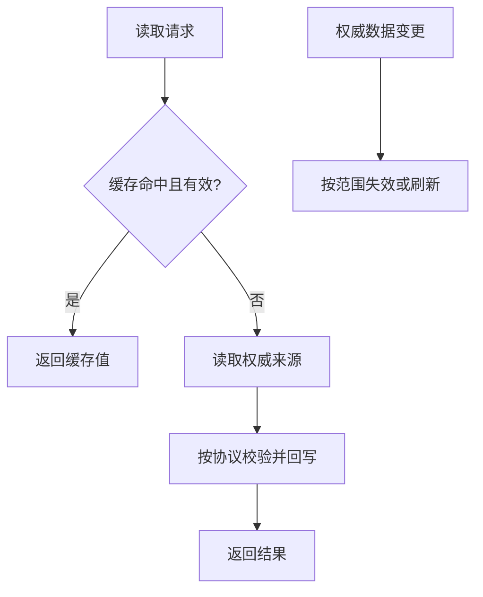

# <缓存名称> 缓存协议

> 仅在缓存被多个责任单元共享、影响业务正确性，或需要约定 key、值结构、TTL、失效、回源和故障语义时使用。纯本地且不形成协作契约的缓存可留在 S10 实现设计中。

## 基础信息

- 缓存类型：本地 / 分布式 / 其他
- 实现载体：
- 责任单元：
- 权威数据模型或来源：
- 协议版本与成熟度：草案 / 待评审 / 已冻结 / 已废弃

## 缓存协议

- Key 前缀、维度和示例：
- 值结构、序列化和版本：
- 空值、缺失值和损坏值语义：
- TTL、最大容量和批量边界：
- 一致性要求与允许短暂过期范围：

## 作用范围

- 使用该缓存的业务入口、调用方或责任单元：
- 明确不使用该缓存的入口：
- 权限、租户和数据隔离边界：
- 读命中、未命中、回源和回写行为：

## 生命周期流程

- 创建、预热或首次写入：
- 更新、删除、停用、恢复时的失效或刷新：
- TTL 到期、主动失效和批量失效：
- 缓存不可用、回源失败、回写失败和并发击穿：
- 日志、指标、追踪和敏感信息边界：
- 兼容、迁移和废弃条件：

S11 缓存协议只定义可被实现和依赖方共同遵守的行为，不引用后续 `WP-XX`、`TASK-XX` 或具体提交。后续工作包和任务引用本协议并声明各自实现范围。
